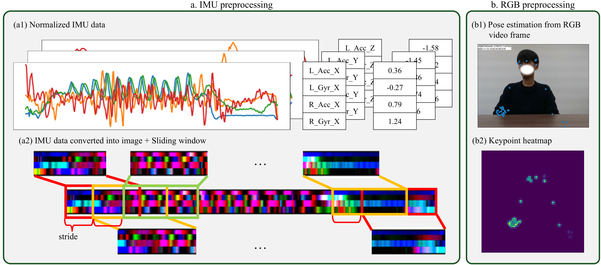
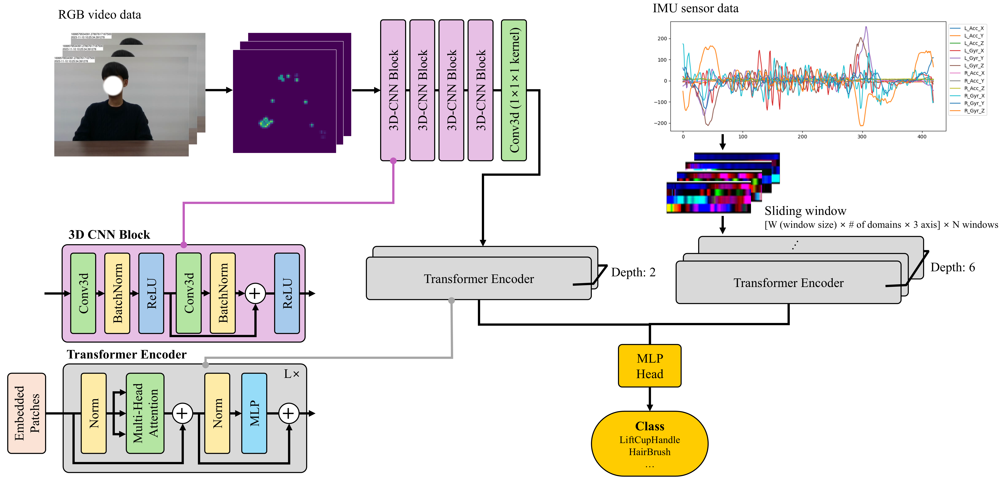

# MMeViT
This is an official implemetnation of arXiv paper: "[MMeViT: Multi-Modal ensemble ViT for Post-Stroke Rehabilitation Action Recognition](https://arxiv.org/submit/6830312)" <!--#나중에수정하기-->

## Overview
We propose a multimodal(3-axis accelerometer and gyrometer from IMU sensors, skeleton from RGBD camera) deep learning model specialized for the Human Action Recognition of post-stroke patients. The sensor data are converted into 3-channel 2D images, and the skeleton data is converted Gaussian map to be respectively used as an input of a ViT-based model that classifies the label(action).

## Codes
```
./codes
│      function.py              // functions for train_test.py
│      train_test.py            // train and test MLP head
│  
├─imu
│      function.py              // functions for dealing IMU data
│      model.py                 // part of IMU model in MMeViT 
│      preprocessing.py         // preprocessing functions of IMU data
│      
└─skeleton
        function.py             // functions for dealing skeleton data
        multi_feature.py        // features of skeleton data 
        
```

### Preprocessing



### Model 
 

## Citations
If you found this repo useful, please consider citing our paper: 
<!-- 나중에수정하기-->
```
@article{kim2025MMeViT,
    title = {MMeViT: Multi-Modal ensemble ViT for Post-Stroke Rehabilitation Action Recognition},
    author = {Kim, Ye-eun and Lim, Suhyeon and Choi, Andrew J.},
    journal = {arXiv preprint arXiv: submit/6830312},
    year = {2025}
} 
```
